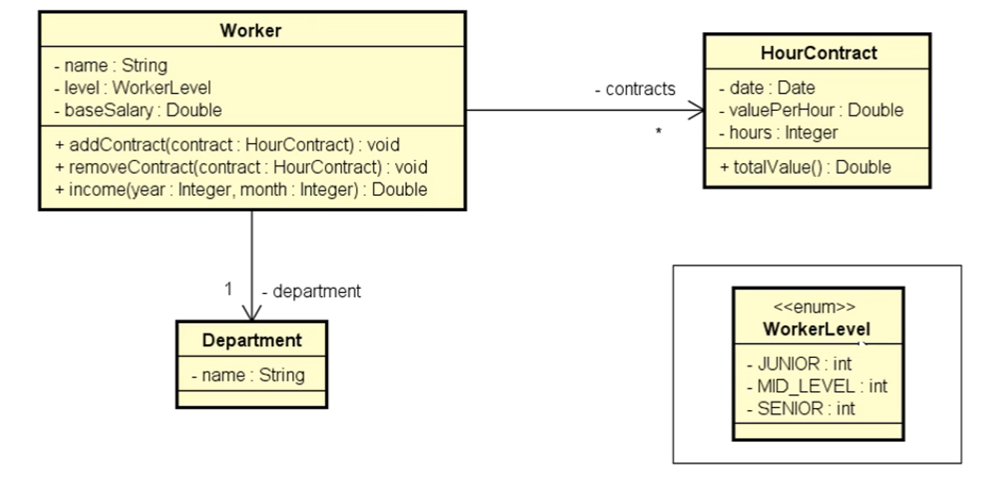
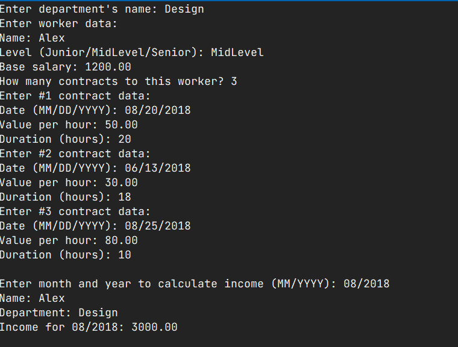

<h2>Este projeto foi desenvolvido com o intuito de utilizar os conceitos de enumeração, composição e os fundamentos da linguagem C# na criação de aplicações. 
 Através dessa implementação, busquei explorar e aplicar essas características, permitindo um melhor entendimento e prática desses conceitos em um contexto real.</h2>

<h2>UML Projeto</h2>

<h2>Console</h2>

